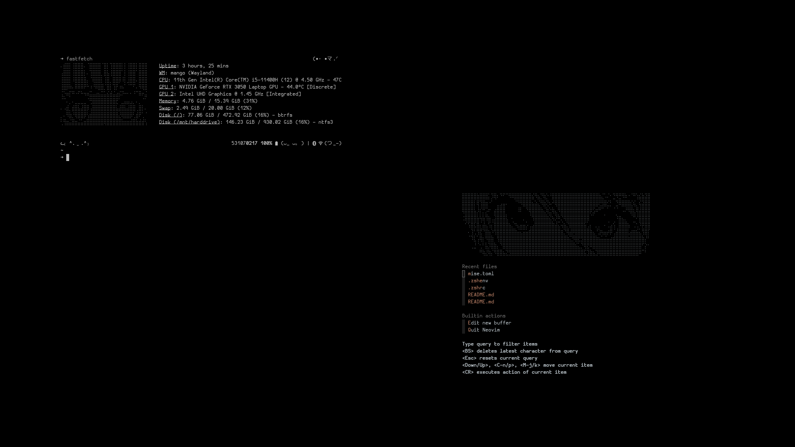

# My Dotfiles

Welcome to my dotfiles repository! These configuration files are designed to
help me quickly set up and customize my Linux development environment and
maintain what I already configured from time to time, which what dotfiles
repo tend to be used for. This repo can be used for any distro (as the configs
are not based on distros, though I use CachyOS as of now) but there are some configs that are specifically used
for some specific distro, I think.

Feel free to explore, fork, or adapt these for your own use!😊

